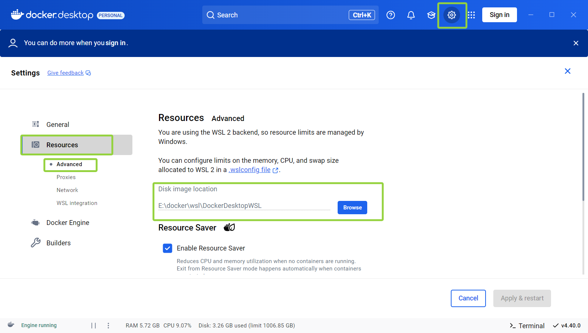
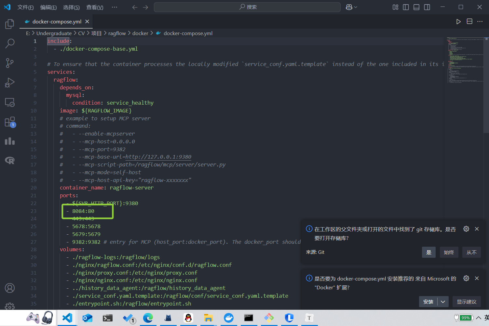
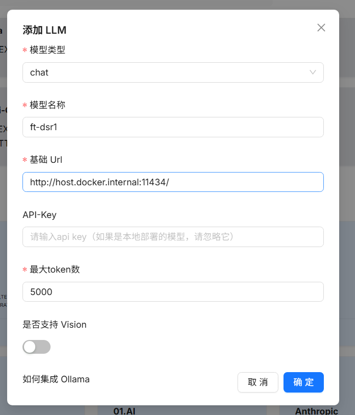

Windows：wsl2本地部署docker-desktop。

官网安装：[Docker: Accelerated Container Application Development](https://www.docker.com/)。

设置docker镜像存储位置

> 一般本地C盘空间较少，部署ragflow后可能就没有多少空间了。
>
> 建议修改存储位置




将ragflow克隆到本地 [infiniflow/ragflow: RAGFlow is an open-source RAG (Retrieval-Augmented Generation) engine based on deep document understanding. (github.com)](https://github.com/infiniflow/ragflow)

并进行ragflow主目录下

可能本地80端口被占用，需要修改`docker/docker-compose.yml`文件下`80:80`，这里改成`8084:80`



之后回到ragflow主目录下，执行指令：

```shell
docker compose -f docker/docker-compose.yml up -d
```


浏览器输入`localhost:8084`进行登录


开启`ollama`服务

```shell
ollama serve
```

运行chat模型

```shell
ollama run ft-dsr1
```


在ragflow选择ollama进行配置。基础URL使用`http://host.docker.internal:11434/`




设置默认模型后，在聊天栏进行测试。


创建知识库，调整参数，进行对话。

