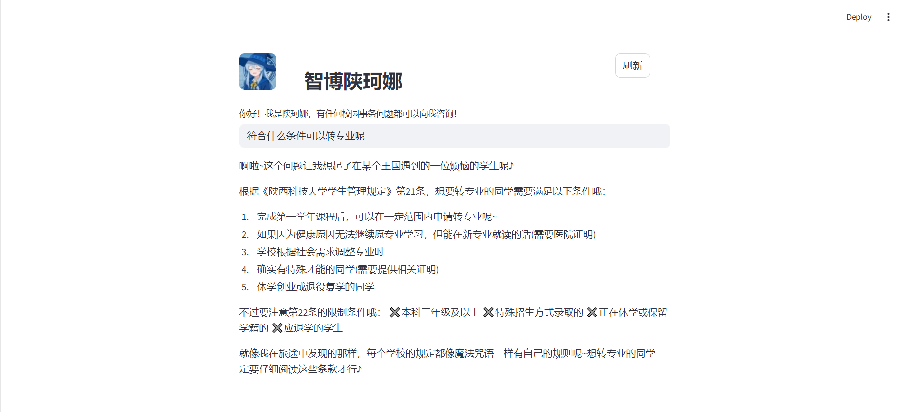

**目标**：微调大模型得到特定语气风格，使用RAG增强特定学校的学生规章制度信息。

- 基座模型：deepseek-ai/DeepSeek-R1-Distill-Qwen-1.5B ([deepseek-ai/DeepSeek-R1-Distill-Qwen-1.5B at main (huggingface.co)](https://huggingface.co/deepseek-ai/DeepSeek-R1-Distill-Qwen-1.5B/tree/main))

- 微调数据集：对deepseek-r1采用提示学习得到的伊雷娜对话特征数据集

- RAG语料库：陕西科技大学公开的学生规章制度等内容（PDF格式）

**实现效果**：

- 微调：没有性能较好的服务器和显卡，采用小模型微调效果较差，体验上不如大模型（DeepSeek-R1）加提示词
- RAG：有效果

- 简易系统：

**过程**：

...

**总结**：

- 微调性价比较低：小模型微调不如大模型＋提示词效果好；大模型微调成本高。感觉现阶段适合中等规模的大模型，但是对于整个大模型发展来看，微调有用途但会集中在科技大厂。

- RAG性价比很高

  优点：

  - **实时性**
  - **减少数据泄露风险**
  - **减少垂直领域幻觉问题**
  - **减少中“毒”风险**

  缺点：信息的完整性获取

- 智能体、MCP：取决于大模型性能及大模型的某种偏好。大模型有动态评判标准，但是难以找到其评估范围。

**参考**：

- [【DeepSeek+LoRA+FastAPI】开发人员如何微调大模型并暴露接口给后端调用_哔哩哔哩_bilibili](https://www.bilibili.com/video/BV1R6P7eVEtd/?spm_id_from=333.1387.homepage.video_card.click)

- 等