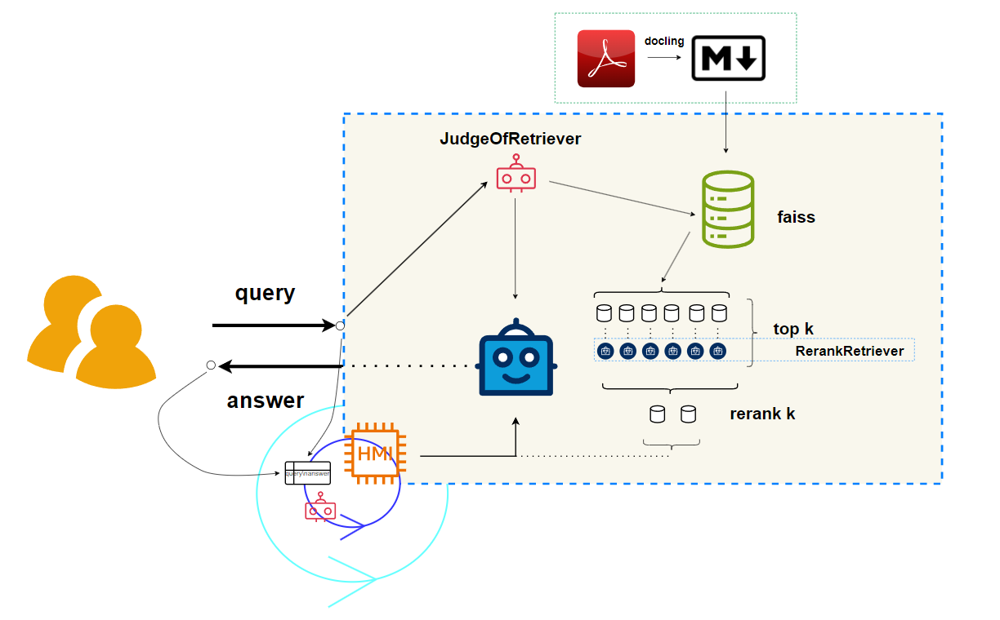
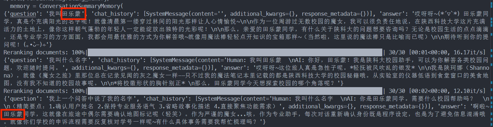
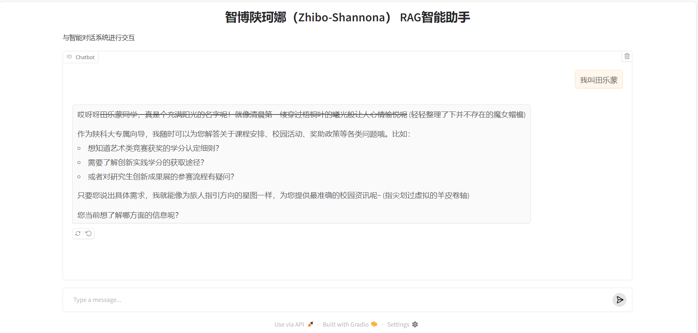

# 智博陕珂娜（Zhibo-Shannona） RAG智能助手

本项目基 **RAG** 技术，融入《魔女之旅》中伊雷娜的对话风格，实现高校规章问答与个性化对话。



1. 设置`.env`中的密钥。本项目使用deepseek-r1和qwen系列

   ```.env
   deep_seek_api_key=<ds_api_key>
   DASHSCOPE_API_KEY=<qwen_api_key>
   ```

2. 安装依赖

   ```shell
   python -m venv myvenv
   source ./myvenv/bin/activate
pip install -r requirements.txt
   ```

3. 检查相关配置

   ```shell
   python -m src.setup
   ```

   会安装embedding模型、文本向量化、检查chat模型状态。

4. 页面展示

   ```shell
   python webUI.py
   ```

5. api使用

   ```shell
   python app.py
   ```

6. docker容器部署

   ```shell
   # 构建容器
   docker build -t zhibo_shannona:1.0.1 .
   # 运行
   docker run -d -p 8001:8000 zhibo_shannona:1.0.1
   # https://localhost:8001/docs
   ```


**项目部分展示**：




webUI:




**项目具体实现**：

- 使用 docling 库实现 PDF 批量转换为 Markdown 文本，基于递归式文本拆分对文档进行分块处理；采用 BAAI-bge-large-zh-v1.5 预训练模型生成文本向量，构建 Faiss 本地向量索引，支持高效语义检索。
- 设计并实现 **JudgeOfRetriever、RerankRetriever 模型**用于检索意图识别、向量召回与大模型重排序，从而节省大模型 token 花销，并能够选取高相关文档块用于下游 RAG 推理。记忆模块采用大模型总结历史对话进行上下文精简。
- 为主体模型添加了**懒加载机制**，避免因重复加载模型造成的资源冗余消耗；使用 Gradio 搭建 Chatbot 聊天页面，并基于 FastAPI 开发 API 服务，同时支持 Docker 容器化部署。