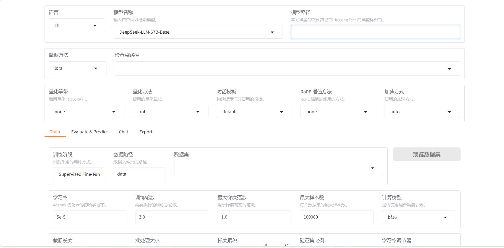
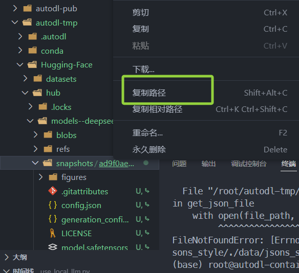
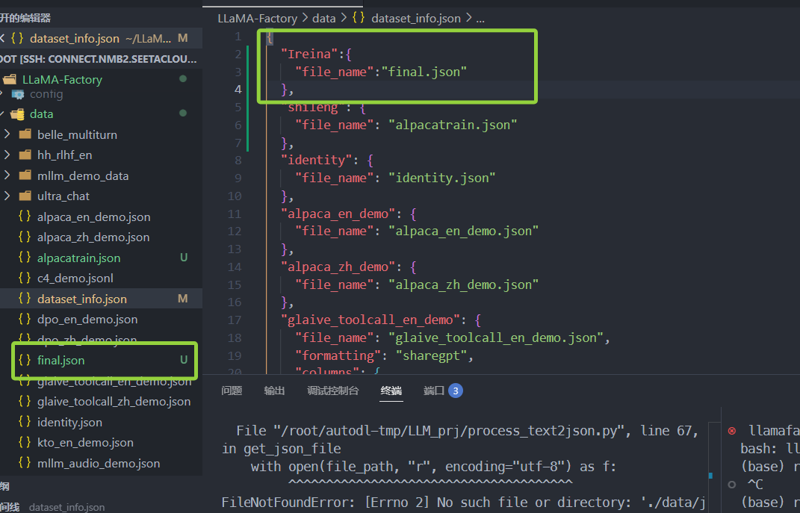
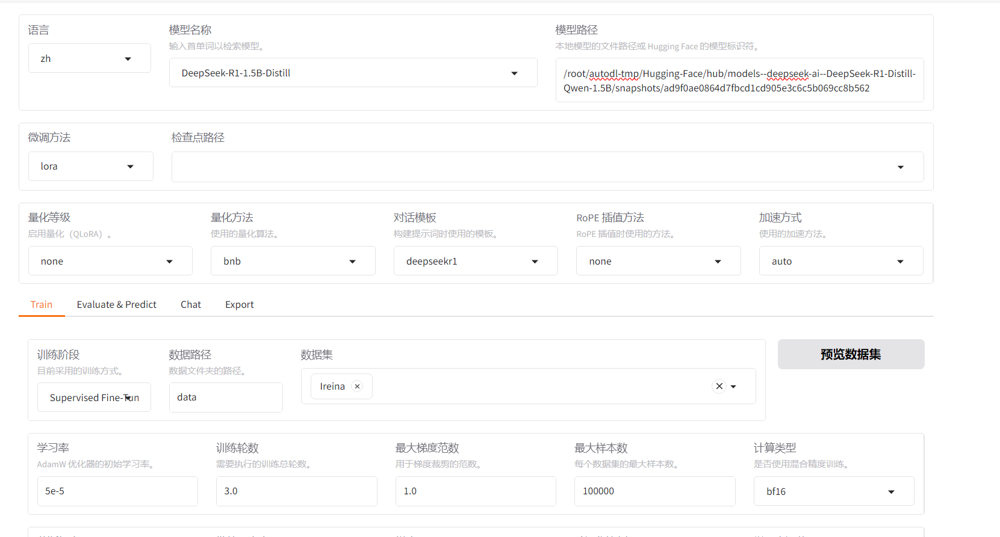
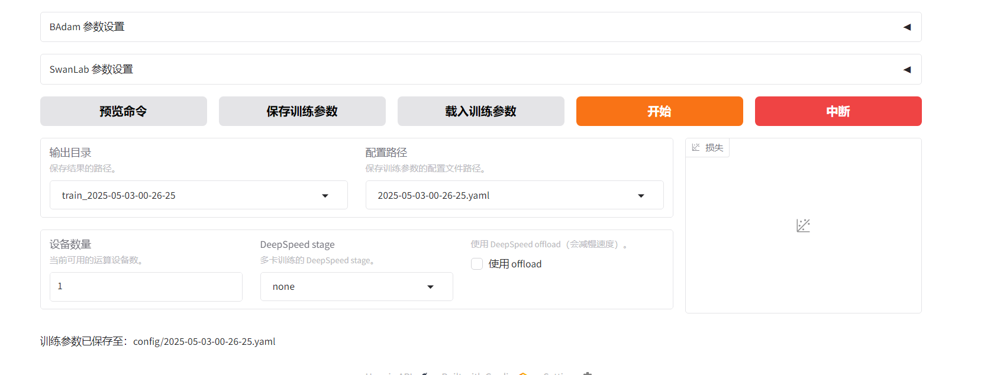
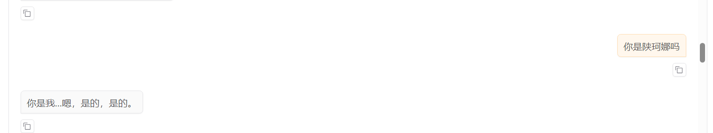
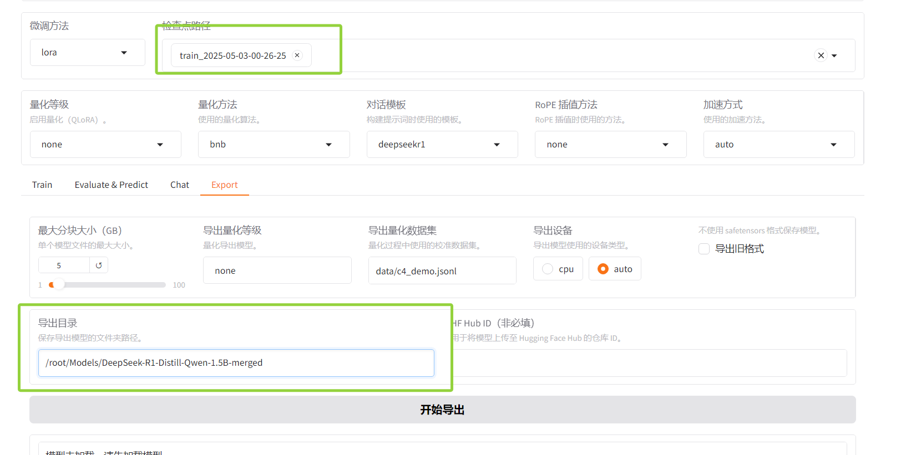
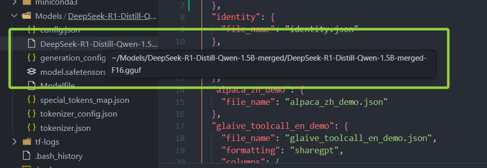

> 使用autoDL算力平台，租借RTX 3090(24G)。
>
> vscode远程访问服务器


微调部分使用LLaMA-Factory进行简单微调。


**LLaMA-Factory**

1. 安装LLaMA-Factory

```shell
git clone --depth 1 https://github.com/hiyouga/LLaMA-Factory.git
```

2. 切换到目录

```shell
cd LLaMA-Factory
```

3. 修改配置，将 conda 虚拟环境安装到数据盘

> 注意autoDL的**系统盘**和**数据盘**的区别。实测中不将虚拟环境定向到数据盘，后面可能没有存储空间！！！

```shell
mkdir -p /root/autodl-tmp/conda/pkgs 
conda config --add pkgs_dirs /root/autodl-tmp/conda/pkgs 
mkdir -p /root/autodl-tmp/conda/envs 
conda config --add envs_dirs /root/autodl-tmp/conda/envs
```

4. 创建conda虚拟环境并激活

```shell
conda create -n llama-factory python=3.10
conda activate llama-factory
```

5. 在虚拟环境中安装 LLaMA Factory 相关依赖

```shell
pip install -e ".[torch,metrics]"
```

6. 检验是否安装成功

```shell
llamafactory-cli version
```


**HuggingFace**

从 HuggingFace 上下载基座模型

1. 创建⽂件夹统⼀存放所有基座模型

```shell
mkdir Hugging-Face
```

2. 修改 HuggingFace 的镜像源

```shell
export HF_ENDPOINT=https://hf-mirror.com
```

3. 修改模型下载的默认位置

```shell
export HF_HOME=/root/autodl-tmp/Hugging-Face
```

> 注意：这种配置⽅式只在当前 shell 会话中有效

4. 安装 HuggingFace 官⽅下载⼯具

```shell
pip install -U huggingface_hub
```

5. 安装Qwen3-4B基座模型

```shell
huggingface-cli download --resume-download deepseek-ai/DeepSeek-R1-Distill-Qwen-1.5B
```


**微调**

执行可视化界面

> 下面指令要在`LLaMA-Factory`目录下执行，如果不在此处执行，则不会显示dataset信息


```shell
llamafactory-cli webui
```

自动跳转到页面



- 模型路径使用绝对路径



```
/root/autodl-tmp/Hugging-Face/hub/models--deepseek-ai--DeepSeek-R1-Distill-Qwen-1.5B/snapshots/ad9f0ae0864d7fbcd1cd905e3c6c5b069cc8b562
```

- 根据模型选择模型名称
- 将微调数据集放入`/root/LLaMA-Factory/data`内，并修改`dataset_info.json`的内容



在页面上选择`Ireina`



下面可以查看训练指令等信息

进行参数设置后，点击“开始”进行训练。



进行测试



训练完后，导出合并后的模型

1. 创建模型目录

```shell
mkdir -p Models/DeepSeek-R1-Distill-Qwen-1.5B-merged
```

2. 在⻚⾯上配置导出路径，导出即可




**转为gguf格式**

1. 工具下载

```shell
git clone https://github.com/ggerganov/llama.cpp.git
cd llama.cpp/gguf-py
pip install --editable .
```

或者官网压缩包下载(推荐，[ggml-org/llama.cpp: LLM inference in C/C++ (github.com)](https://github.com/ggml-org/llama.cpp))

2. 进入`llama.cpp 项目根目录`执行

```
python convert_hf_to_gguf.py /root/Models/DeepSeek-R1-Distill-Qwen-1.5B-merged
```




**ollama**

使用ollama进行本地部署

安装ollama库：

```shell
curl -fsSL https://ollama.com/install.sh | sh
```

启动ollama：

```shell
ollama serve
```

注册要部署的模型文件

```
ollama create ft-dsr1 -f /root/Models/DeepSeek-R1-Distill-Qwen-1.5B-merged/Modelfile
```

运行模型

```shell
ollama run ft-dsr1
```


autoDL不能向外部暴露端口，所以之后将这个模型导出到本地（Windows：wsl2）

后面在本地使用。

[Windows下最详尽的Ollama+Deepseek-r1 本地部署手册 - jack_Meng - 博客园 (cnblogs.com)](https://www.cnblogs.com/mq0036/p/18715694)


[LLaMA-Factory QuickStart - 知乎 (zhihu.com)](https://zhuanlan.zhihu.com/p/695287607)